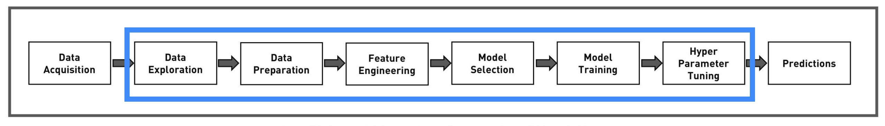
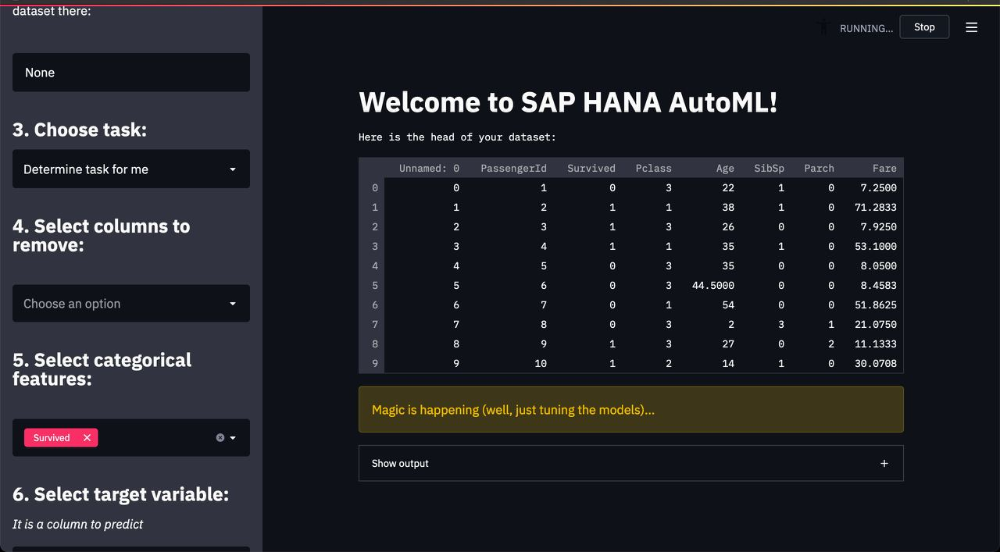

<!-- PROJECT LOGO -->
<br />
<p align="center">
  <a href="https://github.com/dan0nchik/SAP-HANA-AutoML">
    
  </a>


  <p align="center">
    Simple but powerful Automated Machine Learning library for tabular data. It uses efficient in-memory SAP HANA algorithms to automate routine Data Science tasks.
    <br />
    <a href="https://sap-hana-automl.readthedocs.io/en/latest/index.html"><strong>📚 Explore the docs »</strong></a>
    <br />
    <br />
    <a href="https://github.com/dan0nchik/SAP-HANA-AutoML/issues">🐞 Report Bug</a>
    ·
    <a href="https://github.com/dan0nchik/SAP-HANA-AutoML/issues">🆕 Request Feature</a>
  </p>
</p>


<!-- TABLE OF CONTENTS -->
<details open="open">
  <summary><h2 style="display: inline-block">Table of Contents</h2></summary>
  <ol>
    <li>
      <a href="#about-the-project">About The Project</a>
    </li>
    <li>
      <a href="#getting-started">Getting Started</a>
      <ul>
        <li><a href="#prerequisites">Prerequisites</a></li>
        <li><a href="#installation">Installation</a></li>
      </ul>
    </li>
    <li><a href="#usage">Usage</a></li>
    <li><a href="#roadmap">Roadmap</a></li>
    <li><a href="#contributing">Contributing</a></li>
    <li><a href="#license">License</a></li>
    <li><a href="#contact">Contact</a></li>
    <li><a href="#acknowledgements">Acknowledgements</a></li>
  </ol>
</details>


<!-- ABOUT THE PROJECT -->
# About the project

## Docs
https://sap-hana-automl.readthedocs.io/en/latest/index.html

## Benchmarks
https://github.com/dan0nchik/SAP-HANA-AutoML/tree/main/benchmarks

## ML tasks:
-   [x] Binary classification
-   [x] Regression
-   [ ] Multiclass classification
-   [ ] Forecasting

## Steps automated:
- [ ] Data exploration
- [x] Data preparation
- [ ] Feature engineering
- [x] Model selection
- [x] Model training
- [x] Hyperparameter tuning

👇 By the end of summer 2021, blue part will be fully automated by our library


## Clients

* GUI (Streamlit app)
* Python library
* CLI (coming soon)

Streamlit client



## Built With

* [Python3](https://www.python.org/)
* [hana_ml](https://pypi.org/project/hana-ml/)
* [Optuna](https://optuna.org)
* [BayesianOptimization](https://github.com/fmfn/BayesianOptimization)
* [Streamlit](https://streamlit.io)


<!-- GETTING STARTED -->
# Getting Started

To get a package up and running, follow these simple steps.

## Prerequisites

Make sure you have the following:  
1. **✅ Setup SAP HANA** (skip this step if you have an instance with PAL enabled). 
There are 2 ways to do that.  
In HANA Cloud:
    * [Create](https://www.sap.com/cmp/td/sap-hana-cloud-trial.html) a free trial account  
    * [Setup](https://saphanajourney.com/hana-cloud/learning-article/how-to-create-your-trial-sap-hana-cloud-instance/) an instance  
    * [Enable](https://help.sap.com/viewer/db19c7071e5f4101837e23f06e576495/2020_03_QRC/en-US/502e458a260d4445810e6b9094c5b7e7.html) PAL - Predictive Analysis Library. It is vital to enable it because we use their algorithms.
    
    In Virtual Machine:
      * Rent a virtual machine in Azure, AWS, Google Cloud, etc.
      * [Install](https://developers.sap.com/group.hxe-install-binary.html) HANA instance there or on your PC (if you have >32 Gb RAM).
      * [Enable](https://www.youtube.com/watch?v=NyEIj76aqFg&list=PLkzo92owKnVy6nOZMFZIZxcvBCoRdshsR&index=19) PAL - Predictive Analysis Library. It is vital to enable it because we use their algorithms.
2. **✅ Installed software**
* Python > 3.6  
  Skip this step if ``python --version`` returns > 3.6
* Cython
  ```sh
  pip3 install Cython
  ```

## Installation
There are 2 ways to install the library
* Stable: from pypi (currently the project lives on Test Pypi)
   ```sh
   pip3 install --extra-index-url https://test.pypi.org/simple/ hana_automl
   ```
* Latest: from the repository
   ```sh
   pip3 install https://github.com/dan0nchik/SAP-HANA-AutoML/archive/dev.zip
   ```
  **Note:** latest version may contain bugs, be careful!
## After installation
Check that PAL (Predictive Analysis Library) is installed and roles are granted
* Read docs section about that.
* If you don't want to read docs, run this code  
  ```python
  from hana_automl.utils.scripts import setup_user
  from hana_ml.dataframe import ConnectionContext
  
  cc = ConnectionContext(address='address', user='user', password='password', port=39015)
  
  # replace with credentials of user that will be created or granted a role to run PAL.
  setup_user(connection_context=cc, username='user', password="password")
   ```


<!-- USAGE EXAMPLES -->
# Usage 

## From code
Our library in a few lines of code

Connect to database.
```python
from hana_ml.dataframe import ConnectionContext

cc = ConnectionContext(address='address',
                     user='username',
                     password='password',
                     port=1234)

```
Create AutoML model and fit it.
```python
from hana_automl.automl import AutoML

model = AutoML(cc)
model.fit(
  file_path='path to training dataset', # it may be HANA table/view, or pandas DataFrame
  steps=10, # number of iterations
  target='target', # column to predict
  time_limit=120 # time limit in seconds
)
```
Predict.
```python
model.predict(
file_path='path to test dataset',
id_column='ID',
verbosity=2
)
```

_For more examples, please refer to the [Documentation](https://sap-hana-automl.readthedocs.io/en/latest/index.html)_

## How to run Streamlit client
1. Clone repository: `git clone https://github.com/dan0nchik/SAP-HANA-AutoML.git`
2. Install dependencies: `pip3 install -r requirements.txt`
3. Run GUI: `streamlit run ./web.py`


<!-- ROADMAP -->
# Roadmap

See the [open issues](https://github.com/dan0nchik/SAP-HANA-AutoML/issues) for a list of proposed features (and known issues). Feel free to report any bugs :)


<!-- CONTRIBUTING -->
# Contributing

Any contributions you make are **greatly appreciated** 👏!

1. Fork the Project
2. Create your Feature Branch (`git checkout -b feature/NewFeature`)
3. Install dependencies  
    ```sh
   pip3 install -r requirements.txt
   ```
4. Create `credentials.py` file in `tests` directory
    Your files should look like this:  
    ```
    SAP-HANA-AutoML
    │   README.md
    │   all other files   
    │   .....
    |
    └───tests
        │   test files...
        │   credentials.py
      ```

    Copy and paste this piece of code there and replace it with your credentials:
    ```python
    host = "host"
    user = "username"
    password = "password"
    port = 39015
    schema = "your schema"
    ```
    Don't worry, **this file is in .gitignore**, so your credentials won't be seen by anyone.

5. Make some changes
6. Write tests that cover your code in `tests` directory
7. Run tests (under `SAP-HANA-AutoML directory`)
    ```sh
    pytest
    ```
8. Commit your changes (`git commit -m 'Add some amazing features'`)
9. Push to the branch (`git push origin feature/AmazingFeature`)
10. Open a Pull Request


<!-- LICENSE -->
# License

Distributed under the MIT License. See `LICENSE` for more information.  
Don't really understand license? Check out the [MIT license summary](https://tldrlegal.com/license/mit-license).


<!-- CONTACT -->
# Contact

Authors: [@While-true-codeanything](https://github.com/While-true-codeanything), [@DbusAI](https://github.com/DBusAI), [@dan0nchik](https://github.com/dan0nchik)

Project Link: https://github.com/dan0nchik/SAP-HANA-AutoML


<!-- ACKNOWLEDGEMENTS -->


<!-- MARKDOWN LINKS & IMAGES -->
<!-- https://www.markdownguide.org/basic-syntax/#reference-style-links -->
[contributors-shield]: https://img.shields.io/github/contributors/dan0nchik/repo.svg?style=for-the-badge
[contributors-url]: https://github.com/dan0nchik/repo/graphs/contributors
[forks-shield]: https://img.shields.io/github/forks/dan0nchik/repo.svg?style=for-the-badge
[forks-url]: https://github.com/dan0nchik/repo/network/members
[stars-shield]: https://img.shields.io/github/stars/dan0nchik/repo.svg?style=for-the-badge
[stars-url]: https://github.com/dan0nchik/repo/stargazers
[issues-shield]: https://img.shields.io/github/issues/dan0nchik/repo.svg?style=for-the-badge
[issues-url]: https://github.com/dan0nchik/repo/issues
[license-shield]: https://img.shields.io/github/license/dan0nchik/repo.svg?style=for-the-badge
[license-url]: https://github.com/dan0nchik/repo/blob/master/LICENSE.txt
[linkedin-shield]: https://img.shields.io/badge/-LinkedIn-black.svg?style=for-the-badge&logo=linkedin&colorB=555
[linkedin-url]: https://linkedin.com/in/dan0nchik