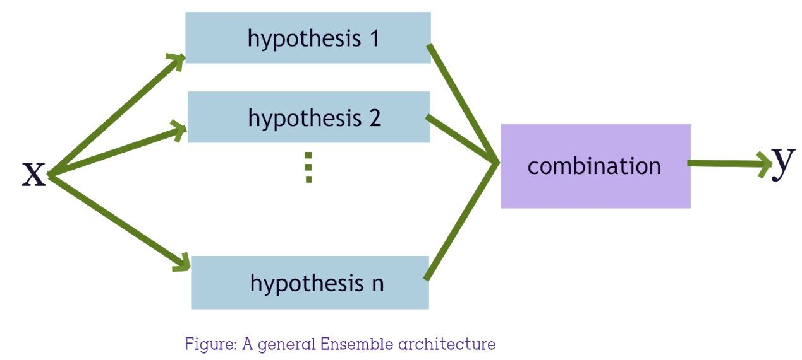

Ensembles
*********

Ensemble is just a boolean flag in our fit function. However,there are some lines of code hidden under it.
Well, how do ensembles actually work? In our library, currently only *blending* technique is supported.
Blending is an ensemble machine learning technique that uses a machine learning model to learn how to best combine the predictions from multiple contributing ensemble member models.

It takes top 3 algorithms with highest accuracy on validation data from model list.
To enable ensemble, just pass *ensemble=True* to :meth:`hana_automl.automl.AutoML.fit` function when creating AutoML model.
