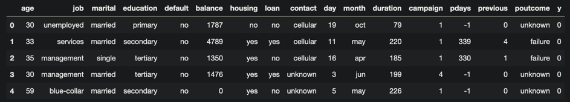

3. Fitting the model
********************

Ok, you have downloaded the library and ready to do some Data Science! Firstly, let's get used to an example data. It's an imaginary data from bank. We need to predict whether the bank needs to give the loan to client, or not. It's called target feature. In the dataset it is column 'y'.
Let's load the dataframe:

.. code-block:: python

    import pandas as pd #pip install pandas
    df = pd.read_csv('https://raw.githubusercontent.com/dan0nchik/SAP-HANA-AutoML/main/data/bank.csv')
    df.head()

To connect to HANA database, we need ConnectionContext.
Fill your database credentials there.

.. code-block:: python

    from hana_ml.dataframe import ConnectionContext

    connection_context = ConnectionContext(address='database address',
                                           user='your username',
                                           password='your password',
                                           port=9999)

.. tip::
    Store the database credentials securely! For example, put the passwords in a separate config/ini file that is not deployed with the project. 

Now create the AutoML object. This will be our model.

.. code-block:: python

    model = AutoML(connection_context)
    m.fit(
        df = df, # dataframe
        target="y", # column to predict
        id_column='ID', # id column (optional)
        categorical_features=["y", 'marital', 'education', 'housing', 'loan'],
        columns_to_remove=['default', 'contact', 'month', 'poutcome'],
        steps=10,
    )

Confused about categorical features? Read about them here. :meth:`hana_automl.automl.AutoML.fit`

.. note::
    Pass the **whole** dataframe as *df* parameter. We will automatically divide it in X_train, y_train, etc.

This is a minimal example. For more advanced usage, head to :meth:`hana_automl.automl.AutoML`
